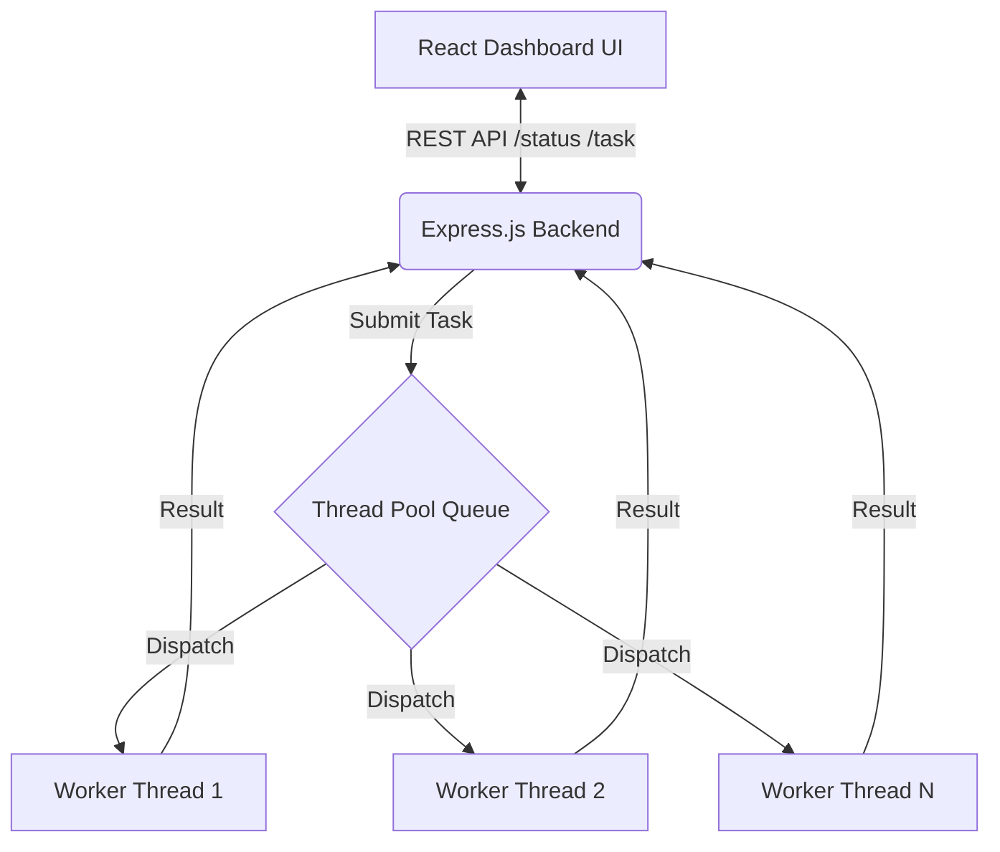

# Thread Pool Simulator for Concurrent Server Applications

A complete Operating System-inspired project that demonstrates a Thread Pool Framework with visualization using a modern React frontend and a Node.js worker-threads backend.

## 🏗️ Architecture



## ✨ Features
- **Dynamic Thread Pool:** Resize the pool on the fly (1-20 threads).
- **Task Priorities:** High (0), Medium (1), Low (2).
- **CPU & I/O Bound Simulations:** True multithreading using Node's `worker_threads`.
- **Live Telemetry:** Real-time Area charts showing Queue Size vs Active Threads.
- **Benchmark Tool:** Compare creating thread-per-task vs using the Thread Pool.

## 🚀 Setup & Running Instructions

### 1. Start the Backend
Open a terminal and navigate to the backend folder:
```bash
cd backend
npm install
npm start
# Server runs on http://localhost:3001
```

### 2. Start the Frontend
Open a new terminal and navigate to the frontend folder:
```bash
cd frontend
npm install
npm run dev
# Vite runs on http://localhost:5173
```

## 📖 API Documentation

### `POST /task`
Submit a new task to the pool.
**Body:** `{ "type": "cpu", "param": 100, "priority": 1 }`
- `type`: "cpu" (calculates square roots) or "io" (setTimeout delay).
- `param`: The weight or delay time.
- `priority`: 0 (High), 1 (Medium), 2 (Low).

### `GET /status`
Get the live status of the thread pool.
**Returns:** JSON object with `totalWorkers`, `activeThreads`, `idleThreads`, `queueSize`, `completedTasks`, and `logs` array.

### `POST /resize`
Dynamically resize the thread pool.
**Body:** `{ "size": 6 }`

### `POST /shutdown`
Gracefully terminate the pool. Threads complete their current tasks then exit.

### `POST /compare`
Run a benchmark comparing standard thread creation vs Thread Pool.
**Body:** `{ "taskCount": 20, "type": "cpu", "param": 200 }`
